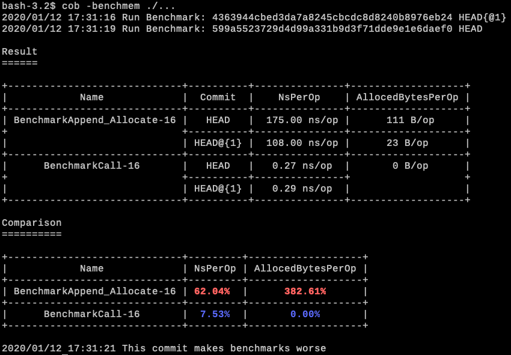

[](https://github.com/knqyf263/cob/releases/latest)

[](https://goreportcard.com/report/github.com/knqyf263/cob)
[](https://github.com/knqyf263/cob/blob/master/LICENSE)


# Abstract
`cob` compares benchmarks between the latest commit (HEAD) and the previous commit (HEAD{@1}). The program will fail if the change in score is worse than the threshold. This tools is suitable for CI/CD to detect a regression of a performance automatically.



`cob` runs `go test -bench` before and after commit internally, so it depends on `go` command.

**CAUTION: Note that `git reset` is executed when you run `cob`. You should commit all changes before running `cob`.**

# Table of Contents
<!-- TOC -->
- [Abstract](#abstract)
- [Continuous Integration (CI)](#continuous-integration-ci)
  - [GitHub Actions](#github-actions)
  - [Travis CI](#travis-ci)
  - [CircleCI](#circleci)
- [Example](#example)
  - [Run only those benchmarks matching a regular expression](#run-only-those-benchmarks-matching-a-regular-expression)
  - [Show only benchmarks with worse score](#show-only-benchmarks-with-worse-score)
  - [Specify a threshold](#specify-a-threshold)
  - [Specify a base commit compared with HEAD](#specify-a-base-commit-compared-with-head)
  - [Compare only memory allocation](#compare-only-memory-allocation)
- [Usage](#usage)
- [Q&A](#qa)
  - [A result of benchmarks is unstable](#a-result-of-benchmarks-is-unstable)

# Continuous Integration (CI)

See [cob-example](https://github.com/knqyf263/cob-example) for details.

## GitHub Actions

```
name: Bench
on: [push, pull_request]
jobs:
  test:
    name: Bench
    runs-on: ubuntu-latest
    steps:

    - name: Set up Go 1.13
      uses: actions/setup-go@v1
      with:
        go-version: 1.13
      id: go

    - name: Check out code into the Go module directory
      uses: actions/checkout@v1

    - name: Install cob
      run: curl -sfL https://raw.githubusercontent.com/knqyf263/cob/master/install.sh | sudo sh -s -- -b /usr/local/bin

    - name: Run Benchmark
      run: cob
```

## Travis CI

```
dist: bionic
language: go
go:
  - 1.13.x

before_script:
  - curl -sfL https://raw.githubusercontent.com/knqyf263/cob/master/install.sh | sudo sh -s -- -b /usr/local/bin

script:
  - cob
```

## CircleCI

```
version: 2
jobs:
  bench:
    docker:
      - image: circleci/golang:1.13
    steps:
      - checkout
      - run:
          name: Install cob
          command: curl -sfL https://raw.githubusercontent.com/knqyf263/cob/master/install.sh | sudo sh -s -- -b /usr/local/bin
      - run:
          name: Run cob
          command: cob
workflows:
  version: 2
  build-workflow:
    jobs:
      - bench
```


# Example

## Override a command to measure benchmarks

To measure benchmarks by `make bench`, you can use `-bench-cmd` and `-bench-args` options.

```
$ cob -bench-cmd make -bench-args bench
```

## Run only those benchmarks matching a regular expression

```
$ cob -bench-args "test -bench Append -benchmem ./..."
```

<details>
<summary>Result</summary>

```
2020/01/12 17:32:30 Run Benchmark: 4363944cbed3da7a8245cbcdc8d8240b8976eb24 HEAD{@1}
2020/01/12 17:32:32 Run Benchmark: 599a5523729d4d99a331b9d3f71dde9e1e6daef0 HEAD

Result
======

+-----------------------------+----------+---------------+-------------------+
|            Name             |  Commit  |    NsPerOp    | AllocedBytesPerOp |
+-----------------------------+----------+---------------+-------------------+
| BenchmarkAppend_Allocate-16 |   HEAD   |  179.00 ns/op |      117 B/op     |
+                             +----------+---------------+-------------------+
|                             | HEAD@{1} |  115.00 ns/op |      23 B/op      |
+-----------------------------+----------+---------------+-------------------+

Comparison
==========

+-----------------------------+---------+-------------------+
|            Name             | NsPerOp | AllocedBytesPerOp |
+-----------------------------+---------+-------------------+
| BenchmarkAppend_Allocate-16 | 55.65%  |      408.70%      |
+-----------------------------+---------+-------------------+
```

</details>

## Show only benchmarks with worse score

```
$ cob -only-degression
```

<details>
<summary>Result</summary>

```
2020/01/12 17:48:35 Run Benchmark: 4363944cbed3da7a8245cbcdc8d8240b8976eb24 HEAD{@1}
2020/01/12 17:48:38 Run Benchmark: 599a5523729d4d99a331b9d3f71dde9e1e6daef0 HEAD

Comparison
==========

+-----------------------------+---------+-------------------+
|            Name             | NsPerOp | AllocedBytesPerOp |
+-----------------------------+---------+-------------------+
| BenchmarkAppend_Allocate-16 | 52.34%  |      347.83%      |
+-----------------------------+---------+-------------------+

2020/01/12 17:48:39 This commit makes benchmarks worse
```

</details>

## Specify a threshold

The following option means the program fails if a benchmark score gets worse than 50%.

```
$ cob -threshold 0.5 ./...
```

## Specify a base commit compared with HEAD
By default, `cob` uses `HEAD~1`. If you compare benchmarks with different commit, you can use `--base` option.

```
$ cob --base origin/master ./...
```

## Compare only memory allocation
You can use `-compare` option.

```
$ cob -compare B/op
```

<details>
<summary>Result</summary>

```
2020/01/15 14:46:31 Run Benchmark: 4363944cbed3da7a8245cbcdc8d8240b8976eb24 HEAD~1
2020/01/15 14:46:33 Run Benchmark: 599a5523729d4d99a331b9d3f71dde9e1e6daef0 HEAD

Result
======

+-----------------------------+----------+---------------+-------------------+
|            Name             |  Commit  |    NsPerOp    | AllocedBytesPerOp |
+-----------------------------+----------+---------------+-------------------+
| BenchmarkAppend_Allocate-16 |   HEAD   |  179.00 ns/op |      121 B/op     |
+                             +----------+---------------+-------------------+
|                             | HEAD@{1} |  104.00 ns/op |      23 B/op      |
+-----------------------------+----------+---------------+-------------------+
|      BenchmarkCall-16       |   HEAD   |   0.50 ns/op  |       0 B/op      |
+                             +----------+---------------+                   +
|                             | HEAD@{1} |   0.49 ns/op  |                   |
+-----------------------------+----------+---------------+-------------------+

Comparison
==========

+-----------------------------+---------+-------------------+
|            Name             | NsPerOp | AllocedBytesPerOp |
+-----------------------------+---------+-------------------+
| BenchmarkAppend_Allocate-16 |    -    |      426.09%      |
+-----------------------------+---------+-------------------+
|      BenchmarkCall-16       |    -    |       0.00%       |
+-----------------------------+---------+-------------------+

2020/01/15 14:46:35 This commit makes benchmarks worse
```

</details>

## Skip running cob
If your commit message contains `[skip cob]`, cob is skipped.

```
$ git add README.md
$ git commit -m "[skip cob] update README.md"
$ cob
2020/04/19 12:46:57 [skip cob] is detected, so the benchmark is skipped
```


# Usage

```
NAME:
   cob - Continuous Benchmark for Go project

USAGE:
   cob [global options] command [command options] [arguments...]

COMMANDS:
   help, h  Shows a list of commands or help for one command

GLOBAL OPTIONS:
   --only-degression   Show only benchmarks with worse score (default: false)
   --threshold value   The program fails if the benchmark gets worse than the threshold (default: 0.2)
   --base value        Specify a base commit compared with HEAD (default: "HEAD~1")
   --compare value     Which score to compare (default: "ns/op,B/op")
   --bench-cmd value   Specify a command to measure benchmarks (default: "go")
   --bench-args value  Specify arguments passed to -cmd (default: "test -run '^$' -bench . -benchmem ./...")
   --help, -h          show help (default: false)
```

# Q&A

## Benchmarks with the same name

Specify a package name.

```
$ cob -bench-args "test -bench . -benchmem ./foo" 
$ cob -bench-args "test -bench . -benchmem ./bar" 
```

## A result of benchmarks is unstable

You can specify `-benchtime`.

```
$ cob -bench-args "test -bench . -benchmem -benchtime 10s ./..." 
```

# License

This repository is available under the [MIT](https://github.com/knqyf263/cob/blob/master/LICENSE)

# Author

[Teppei Fukuda](https://github.com/knqyf263) (knqyf263)
